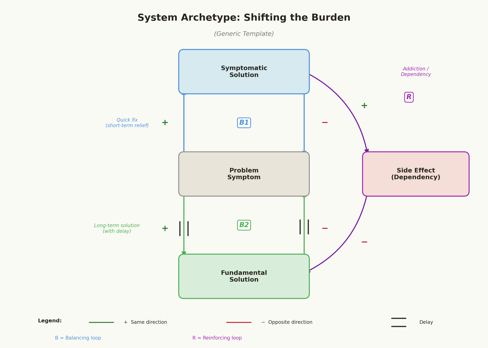
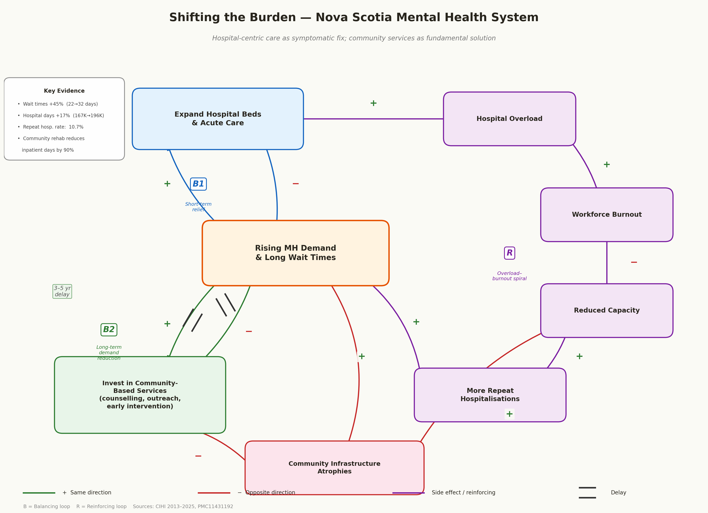

## System Archetype Identification

### Primary Archetype: Shifting the Burden

Shifting the Burden is a system archetype in which a problem symptom is addressed through a quick, symptomatic fix rather than a more difficult fundamental solution. Over time, reliance on the quick fix erodes the capacity for the fundamental solution, creating dependency. In Nova Scotia's mental health system, this archetype describes the structural tension between hospital-based acute care (the symptomatic fix) and community-based services (the fundamental solution).

#### Generic Structure

In the generic Shifting the Burden template, a problem symptom triggers two competing responses: a symptomatic solution that provides fast relief, and a fundamental solution that addresses root causes but operates with a delay. A side effect of the symptomatic solution gradually undermines the fundamental solution, locking the system into growing dependence on the quick fix.

#### Mapping to Nova Scotia's Mental Health System

| Archetype Element | Nova Scotia Context |
|---|---|
| **Problem Symptom** | Rising mental health demand and long wait times (median wait 22 → 32 → 28 days, 2020–2025; [CIHI, 2025](https://yourhealthsystem.cihi.ca/)) |
| **Symptomatic Solution** | Expand hospital beds and acute care capacity |
| **Fundamental Solution** | Invest in community-based services (counselling, outreach, early intervention) |
| **Side Effect** | Hospital overload → workforce burnout → reduced capacity → more repeat hospitalisations; community infrastructure atrophies from underinvestment |
| **Delay** | Community-based programs require 3–5 years to build capacity and show population-level results |

#### Key Variables and Loops Creating Archetypal Behaviour

The archetype operates through three feedback loops identified in our Causal Loop Diagram:

- **B1 — Short-Term Relief (Balancing):** 

Rising demand → expand hospital beds → temporarily absorbs acute cases → demand pressure reduced. This is the "quick fix" loop that provides visible, immediate results.
- **B2 — Long-Term Demand Reduction (Balancing, with delay):** 

Rising demand → invest in community services → improved patient outcomes → fewer acute episodes → demand reduced. This is the fundamental solution loop, but it operates with a 3–5-year delay because community infrastructure (trained counsellors, peer-support networks, early-intervention programs) takes time to establish.
- **R — Overload-Burnout Spiral (Reinforcing):** 

Hospital overload → workforce burnout → reduced capacity → longer waits → more patients deteriorate → more acute admissions → greater overload. This reinforcing loop is the critical side effect that locks the system into hospital dependency.

#### Evidence the Pattern Is Operating

Three lines of evidence from data confirm that Shifting the Burden is actively shaping Nova Scotia's mental health system:

1. **Hospital days growing despite fewer admissions.** 

Total mental health inpatient days rose 17% (167,425 → 196,269) between 2019 and 2024, while the discharge rate fell 19% (627.5 → 510.3 per 100,000). Patients are staying longer and consuming more hospital resources, indicating that the hospital-centric approach is absorbing sicker patients rather than preventing deterioration a hallmark of the symptomatic fix failing to address root causes ([CIHI Your Health System, 2013–2025](https://yourhealthsystem.cihi.ca/)).

2. **Repeat hospitalisations signal inadequate community follow-up.** 

The provincial repeat hospitalisation rate for mental illness is 10.7%, with the Eastern Zone reaching 14.1%. Patients are being discharged without sufficient community support and cycling back into acute care, demonstrating how the symptomatic solution generates its own demand ([CIHI Your Health System, 2013–2025](https://yourhealthsystem.cihi.ca/)).

3. **Community rehabilitation dramatically reduces hospital burden.** 

A systematic review found that community-based rehabilitation programs reduced inpatient days by up to 90% ([Lora et al., 2024, PMC11431192](https://pmc.ncbi.nlm.nih.gov/articles/PMC11431192/)). Yet Nova Scotia's community counselling wait times remain at 28 days median, with 41.5% of adults reporting unmet mental health needs and 54.9% among ages 18–34, indicating the fundamental solution is severely under-resourced ([CIHI Your Health System, 2025](https://yourhealthsystem.cihi.ca/)).

### Secondary Archetype: Fixes that Fail

A supporting archetype, Fixes that Fail, reinforces the primary pattern. Hospital capacity expansion (the "fix") temporarily relieves wait-time pressure but generates unintended consequences workforce burnout, longer average stays, and repeat hospitalisations that worsen the original problem. The data confirm this: hospital days grew 17% even as discharge rates fell 19%, meaning the fix is consuming more resources while producing worse throughput. Patients waiting more than three months for care show significantly worse clinical outcomes (worsened HoNOS scores), further increasing acute-care demand 

([Reichert & Jacobs, 2018, PMC6221005](https://pmc.ncbi.nlm.nih.gov/articles/PMC6221005/)).

---

## Scenario Narratives

The following three scenarios describe how Nova Scotia's mental health system might evolve over the next 5–10 years depending on the funding decision made by the Department of Health and Wellness. Each scenario references feedback loops from the CLD and includes quantitative projections grounded in project data.

### Scenario 1: Status Quo — Continue Current Policy

If the Department of Health and Wellness maintains its current funding distribution with the majority of resources directed toward hospital-based acute care and only incremental investments in community services the Shifting the Burden dynamic intensifies. The reinforcing loop R (Overload-Burnout Spiral) continues unchecked: hospital utilisation, already at 196,269 inpatient days per year and growing at approximately 3.4% annually, could reach 230,000–240,000 days by 2031. Workforce burnout drives attrition, further reducing effective capacity. The balancing loop B1 (Short-Term Relief) provides diminishing returns as added beds are consumed by patients who deteriorated while waiting for community services that were never built.

Wait times for community counselling, currently at a 28-day median, are likely to stagnate or increase, sustaining the 41.5% unmet-need rate. Among young adults aged 18–34 the group with 54.9% unmet need delayed access worsens outcomes and feeds the R1 Deterioration Spiral: unmet need → acute episodes → increased hospital demand → longer waits. Repeat hospitalisation rates, already 10.7% provincially and 14.1% in the Eastern Zone, continue to rise without post-discharge community supports.

The key uncertainty is whether federal funding (the $2M + $1.5M announced in January 2025) might incrementally slow this trajectory. However, without a structural shift in allocation, these amounts are insufficient to reverse the atrophy of community infrastructure. The status quo leads to a system that is more expensive, less effective, and increasingly reliant on crisis-driven hospital care.

### Scenario 2: Intervention A — Community-First Investment Strategy

Under this scenario, the Department reallocates 60–70% of new mental health funding toward community-based services while maintaining (but not expanding) existing hospital capacity. The fundamental solution loop B2 (Long-Term Demand Reduction) is activated: expanded counselling, outreach, peer support, and early-intervention programs gradually improve patient outcomes and prevent deterioration into acute episodes.

In the first 2–3 years, the transition is uncomfortable. Community programs take time to build capacity recruiting and training counsellors, establishing referral pathways, and building community trust. During this ramp-up, hospital demand remains elevated and wait times may not improve visibly, creating political pressure to revert to hospital spending. This is the characteristic "worse before better" delay inherent in the Shifting the Burden archetype.

By years 4–5, the investment yields measurable returns. Community rehabilitation programs, which evidence shows can reduce inpatient days by up to 90%, begin absorbing patients who would otherwise reach crisis. If even a 30–40% reduction in avoidable hospitalisations is achieved, this would free 25,000–35,000 inpatient days annually equivalent to redirecting $15–20M in hospital costs toward further community expansion. The repeat hospitalisation rate could fall from 10.7% toward 7–8% as post-discharge community supports improve. Wait times for counselling could decrease to 14–18 days as capacity grows.

The key uncertainties are workforce recruitment (can Nova Scotia attract enough community mental health professionals?) and the political will to sustain investment through the delayed-return period. The unintended consequence risk is that hospital capacity may become strained during the transition if demand spikes unexpectedly.

### Scenario 3: Intervention B — Balanced Dual Investment with Hospital Reform

This scenario splits new funding roughly evenly between community expansion and hospital system reform specifically targeting the side effects identified in the archetype. Hospital investment focuses not on more beds but on reducing workforce burnout (improved staffing ratios, scheduling reform, peer-support programs for staff) and strengthening discharge-to-community pathways to reduce the 10.7% repeat hospitalisation rate.

This approach simultaneously weakens the reinforcing loop R (Overload-Burnout Spiral) and strengthens the balancing loop B2 (Long-Term Demand Reduction). By improving hospital working conditions, staff retention improves, partially restoring the effective capacity that burnout has eroded. Meanwhile, community investment though at a lower level than Intervention A builds the fundamental solution, albeit more slowly.

Over 5–10 years, this hybrid approach projects moderate improvements on both fronts: hospital days may stabilise at 190,000–200,000 (versus 230,000+ under status quo), and community counselling wait times could decrease to 18–22 days. Repeat hospitalisations might drop to 8–9% as discharge pathways improve. The self-harm hospitalisation rate, which shows a socioeconomic gradient (52 per 100,000 in lowest-income areas vs. 28 in highest-income), could decline further as both hospital and community interventions address equity gaps.

The key uncertainty is whether splitting investment dilutes impact neither arm receives enough funding to achieve transformative change. The risk of this "balanced" approach is that it satisfies political stakeholders on both sides without generating the critical mass needed to break the Shifting the Burden cycle. It may produce incremental improvement rather than systemic change.

---

## Leverage Point Analysis

### Most Promising Leverage Point: Funding Allocation (Community-Based Services)

The single most impactful leverage point in Nova Scotia's mental health system is the Funding Allocation variable specifically, the decision to redirect a substantial share of mental health investment toward community-based services. This is a Meadows-level "rules of the system" intervention (Leverage Point #5 on Meadows' hierarchy) because it changes the structural incentives that currently channel resources toward the symptomatic fix.

#### Why This Point Offers High Impact Relative to Effort

Funding allocation is a decision variable under direct control of the Department of Health and Wellness unlike demand drivers (population mental health), stigma, or workforce supply, which require broader societal change. A single policy decision to shift the funding ratio can propagate effects through multiple feedback loops simultaneously:

- **Activates B2 (Long-Term Demand Reduction):** More community services → better patient outcomes → fewer acute episodes → reduced demand on the entire system. Evidence: community rehabilitation reduces inpatient days by up to 90% ([Lora et al., 2024, PMC11431192](https://pmc.ncbi.nlm.nih.gov/articles/PMC11431192/)).

- **Weakens R (Overload-Burnout Spiral):** Fewer avoidable hospital admissions → lower hospital utilisation → less workforce burnout → better staff retention → more effective capacity. This breaks the reinforcing cycle that is currently driving hospital days upward.

- **Weakens R1 (Deterioration Spiral):** Community services reduce wait times → fewer people with unmet needs → fewer people deteriorating into crisis → less demand pressure. Currently, 41.5% of Canadians with a mental health disorder report unmet need, and waiting more than three months worsens clinical outcomes ([Reichert & Jacobs, 2018, PMC6221005](https://pmc.ncbi.nlm.nih.gov/articles/PMC6221005/)).

- **Addresses equity.** Self-harm hospitalisation rates are nearly twice as high in lowest-income areas (52 vs. 28 per 100,000). Community services which are more geographically distributed and carry less stigma than hospital settings (stigma effected = −0.27 on help-seeking; [Clement et al., 2015, PubMed 24569086](https://pubmed.ncbi.nlm.nih.gov/24569086/)) are better positioned to reach underserved populations.

#### Feedback Loops Affected

| Loop | Direction of Effect |
|---|---|
| B1 (Short-Term Relief) | Weakened less reliance on hospital expansion as primary response |
| B2 (Long-Term Demand Reduction) | Strengthened community services activated as fundamental solution |
| R (Overload-Burnout Spiral) | Weakened reduced hospital load breaks burnout cycle |
| R1 (Deterioration Spiral) | Weakened early intervention prevents demand escalation |

#### Risks and Resistance

1. **Political resistance to delayed results.** 

Community programs take 3–5 years to show population-level impact. Decision-makers face electoral cycles and public pressure to show immediate improvements. Hospital bed announcements are politically visible; community counselling expansion is not.

2. **Workforce recruitment constraints.** 

Nova Scotia already faces healthcare workforce shortages. Expanding community mental health requires recruiting counsellors, social workers, and peer-support specialists who may not be immediately available. Without a parallel workforce development strategy, funding alone will not build capacity.

3. **Risk of hospital capacity strain during transition.** 

If community programs ramp up too slowly while hospital investment flattens, there may be a gap period (years 1–3) where demand exceeds capacity on both fronts. This requires careful sequencing maintaining hospital funding at current levels while ramping community investment, rather than cutting hospital budgets prematurely.

4. **Stakeholder resistance from hospital sector.** 

Hospitals and their associated workforce may perceive funding reallocation as a threat. Successful implementation requires framing the shift as relieving hospital burden, not defunding hospital care.

---

## Implications for the Decision

The systems analysis reveals a clear structural pattern: Nova Scotia's mental health system is locked in a Shifting the Burden dynamic where hospital-based acute care acts as a symptomatic fix that absorbs growing demand while the fundamental solution community-based prevention and early intervention remains under-resourced. The evidence is unambiguous: hospital inpatient days have risen 17% over five years while discharge rates have fallen 19%, repeat hospitalisations persist at 10.7%, and 41.5% of those with mental health disorders report unmet care needs. The system is spending more on acute care and getting worse outcomes the defining signature of this archetype.

Of the three scenarios examined, Intervention A (Community-First Investment) offers the most promising path to breaking this cycle. While it carries short-term political risk due to the 3–5-year delay before visible results, community rehabilitation programs reduce inpatient days by up to 90%, and early intervention prevents the deterioration that feeds hospital demand. Intervention B (Balanced Dual Investment) is a reasonable compromise that reduces political risk but may lack the critical mass to achieve systemic change. The Status Quo leads to continued escalation more hospital days, more burnout, more unmet need.

Key uncertainties remain: workforce availability for community program expansion, political sustainability of a delayed-return investment, and the magnitude of hospital demand reduction achievable through community alternatives. These should be addressed through phased implementation with clear milestones and mid-course evaluation.

---

## References

- CIHI Your Health System Indicator Library (2013–2025). [https://yourhealthsystem.cihi.ca/](https://yourhealthsystem.cihi.ca/)
- Lora, A., et al. (2024). Community-based rehabilitation and mental health inpatient days. *PMC*. [https://pmc.ncbi.nlm.nih.gov/articles/PMC11431192/](https://pmc.ncbi.nlm.nih.gov/articles/PMC11431192/)
- Reichert, A., & Jacobs, R. (2018). The impact of waiting time on patient outcomes: Evidence from early intervention in psychosis services in England. *Health Economics*, 27(11), 1772–1787. [https://pmc.ncbi.nlm.nih.gov/articles/PMC6221005/](https://pmc.ncbi.nlm.nih.gov/articles/PMC6221005/)
- Clement, S., et al. (2015). What is the impact of mental health-related stigma on help-seeking? A systematic review. *Psychological Medicine*, 45(1), 11–27. [https://pubmed.ncbi.nlm.nih.gov/24569086/](https://pubmed.ncbi.nlm.nih.gov/24569086/)
- Government of Canada (2025). Government of Canada and Nova Scotia increase investment in province's community mental health supports. [https://www.canada.ca/en/public-health/news/2025/01/government-of-canada-and-nova-scotia-increase-investment-in-provinces-community-mental-health-supports.html](https://www.canada.ca/en/public-health/news/2025/01/government-of-canada-and-nova-scotia-increase-investment-in-provinces-community-mental-health-supports.html)
