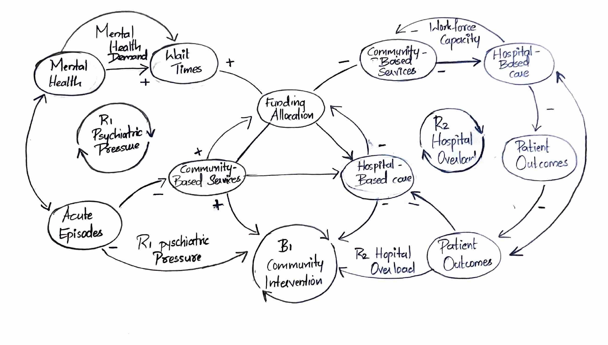

# Community-Based vs Hospital-Based Mental Health Investment in Nova-Scotia

## Decision Statement

Senior leadership within the Nova Scotia Department of Health and Wellness must decide whether to prioritize funding for community-based mental health services or hospital-based mental health care to reduce mental health service wait times over the next five years.

## Executive Summary

Mental health demand in Nova Scotia has increased considerably in recent years, driven by population growth, aging demographics, and the long-term effects of the COVID-19 pandemic. Long wait times for mental health assessments and treatments have created substantial challenges, leading to worsening patient outcomes, increased emergency department visits, and higher system costs.
The provincial Department of Health and Wellness must allocate limited funding effectively to improve system-wide mental health outcomes. Community-based services focus on early intervention, accessibility, and prevention, while hospital-based care addresses acute, severe cases. Each strategy presents trade-offs in terms of effectiveness, resource requirements, and workforce impact. A misallocation could exacerbate wait times, increase staff burnout, and compromise overall care quality.
Applying a systems-thinking perspective helps illuminate the complex interactions between demand, service capacity, workforce availability, and patient outcomes. Understanding these feedback loops enables more informed decision-making that balances preventive and acute care investments.

## Initial Causal Loop Diagram (CLD)

