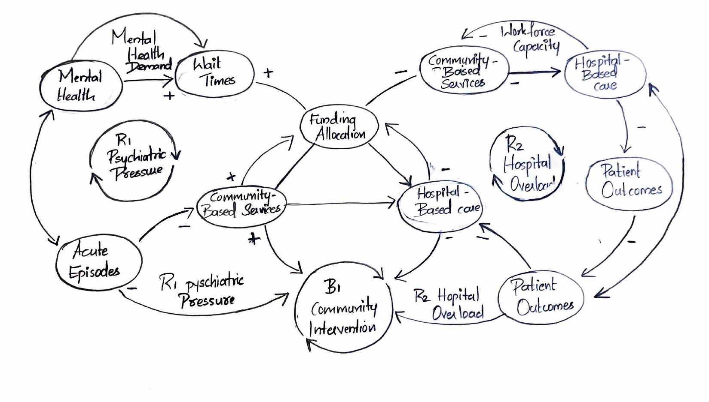
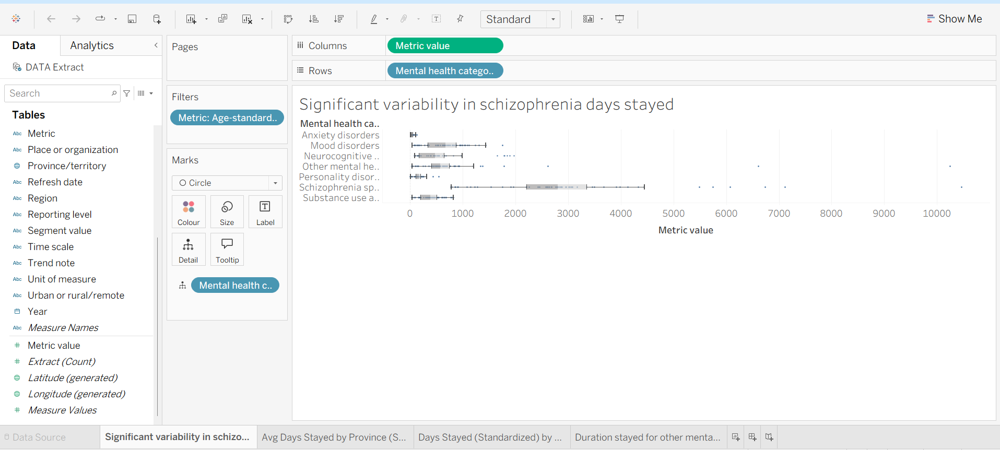
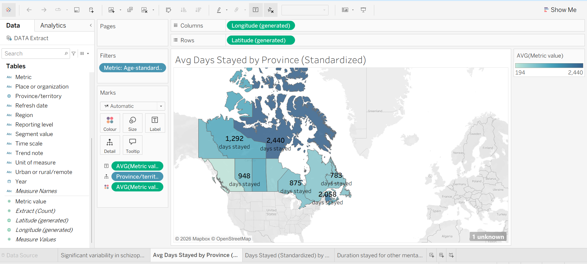
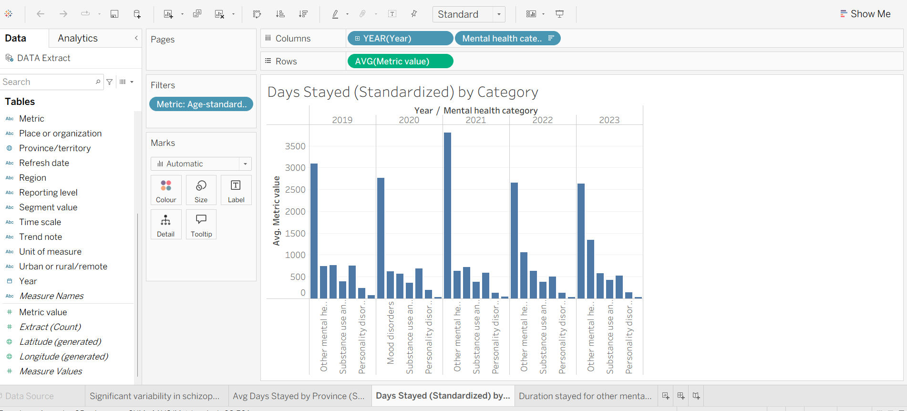
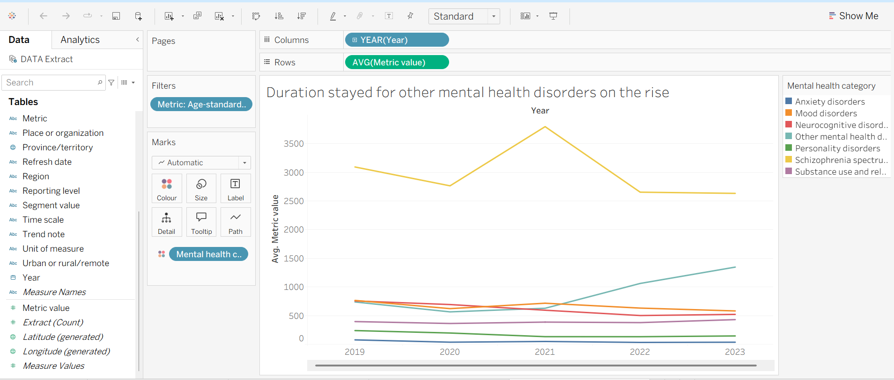
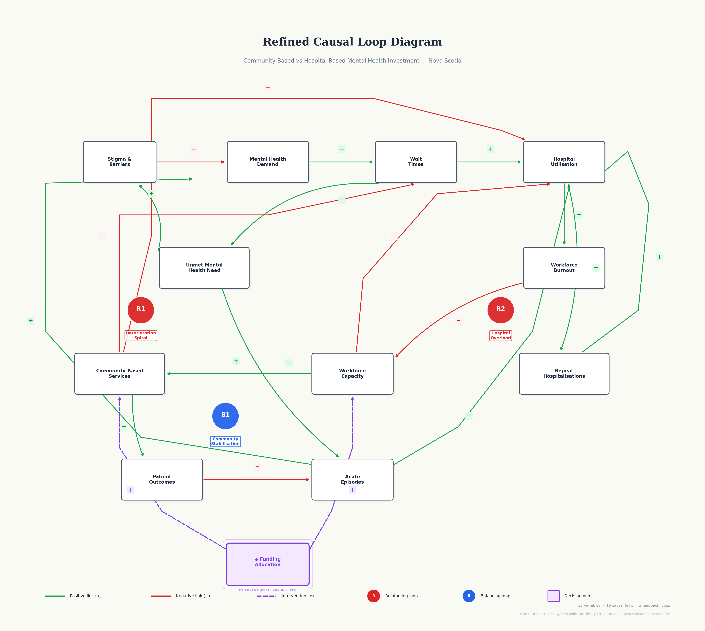

# Community-Based vs Hospital-Based Mental Health Investment in Nova-Scotia

## Decision Statement

Senior leadership within the Nova Scotia Department of Health and Wellness must decide whether to prioritize funding for community-based mental health services or hospital-based mental health care to reduce mental health service wait times over the next five years.

## Summary

Mental health demand in Nova Scotia has increased considerably in recent years, driven by population growth, aging demographics, and the long-term effects of the COVID-19 pandemic. Long wait times for mental health assessments and treatments have created substantial challenges, leading to worsening patient outcomes, increased emergency department visits, and higher system costs.
The provincial Department of Health and Wellness must allocate limited funding effectively to improve system-wide mental health outcomes. Community-based services focus on early intervention, accessibility, and prevention, while hospital-based care addresses acute, severe cases. Each strategy presents trade-offs in terms of effectiveness, resource requirements, and workforce impact. A misallocation could exacerbate wait times, increase staff burnout, and compromise overall care quality.
Applying a systems-thinking perspective helps illuminate the complex interactions between demand, service capacity, workforce availability, and patient outcomes. Understanding these feedback loops enables more informed decision-making that balances preventive and acute care investments.

## Initial Causal Loop Diagram (CLD)

## Data Sources Summary

The data for this project was sourced from the Canadian Institute for Health Information (CIHI) Your Health System Indicator Library, filtered to four mental health-specific indicators for Nova Scotia. The full source dataset contained approximately 48,002 rows spanning over 100 health system indicators. After filtering to mental health indicators only excluding any combined mental health and substance use measures that could not be disaggregated 616 rows were retained across the following four indicators: Canadians With a Mental Health Disorder Who Have an Unmet Need for Mental Health Care (2024), Self-Harm Hospitalizations (2013–2014 to 2024–2025), Self-Harm Including Suicide (2018–2019 to 2023–2024), and Wait Times for Community Mental Health Counselling (2020–2021 to 2024–2025). The filtered dataset was exported into a Tableau Hyper extract dataset3.hyper and used as the primary source for all visualizations in this milestone.

## Exploratory Data Analysis

### Visualization 1: Significant Variability in Schizophrenia Days Stayed

This visualization displays the distribution of age-standardized days stayed across different mental health categories in Nova Scotia, using a box plot to reveal the spread and variability within each group. Schizophrenia spectrum disorders stand out dramatically, showing a significantly wider range and higher median compared to all other categories, with values extending beyond 4,000 days stayed and outliers reaching close to 10,000. In contrast, categories such as anxiety disorders, mood disorders, and personality disorders cluster tightly at much lower values. This matters for the decision-maker because it highlights that schizophrenia-related hospitalizations are not only longer on average but also highly unpredictable in duration, placing a disproportionate and variable burden on Nova Scotia's inpatient mental health capacity. Understanding this variability is critical when planning resource allocation and bed availability across the health system.

### Visualization 2: Average Days Stayed by Province (Standardized)

This geographic visualization maps the average age-standardized days stayed for mental health hospitalizations across Canadian provinces, providing a national context for Nova Scotia's performance. The Northwest Territories records the highest average at 2,440 days stayed, followed by Ontario at 2,058, while British Columbia shows the lowest at 948. Nova Scotia, visible in the eastern region at 783 days stayed, falls below the national average, suggesting relatively shorter hospitalization durations compared to many other provinces. For the decision-maker, this geographic comparison is important because it situates Nova Scotia within the broader Canadian landscape, raising questions about whether shorter stays reflect efficient community-based care, earlier discharge, or potentially unmet post-discharge support needs all of which have direct implications for mental health system planning and investment decisions.

### Visualization 3: Days Stayed (Standardized) by Category

This grouped bar chart shows the average age-standardized days stayed broken down by mental health category across fiscal years 2019 through 2023, allowing both cross-category and year-over-year comparisons. Schizophrenia spectrum disorders consistently dominate across all years, with a notable peak in 2021 reaching approximately 3,700 days, before declining slightly in 2022 and 2023. Other categories including mood disorders, anxiety disorders, and personality disorders remain comparatively stable and low throughout the period. This visualization is valuable for the decision-maker because it shows that the overall burden of long mental health stays is not evenly distributed across diagnoses, and that the 2021 spike in schizophrenia-related stays may reflect pandemic-related disruptions to community mental health supports. Identifying which categories are driving hospitalization duration helps prioritize where targeted interventions would have the greatest impact.

### Visualization 4: Duration Stayed for Other Mental Health Disorders on the Rise

This line chart tracks the trend in average age-standardized days stayed by mental health category from 2019 to 2023, revealing how hospitalization durations have shifted over time. Schizophrenia spectrum disorders remain the highest across all years, peaking sharply in 2021 before moderating. Most notably, the "Other mental health disorders" category shows a steep and consistent upward trend from near zero in 2019 to approximately 1,350 by 2023, making it the fastest-growing category in the dataset. All other categories anxiety, mood, neurocognitive, and personality disorders remain relatively flat or show slight declines over the same period. For the decision-maker, this rising trend in the "Other" category is a critical signal, as it may indicate emerging or underclassified mental health conditions that the current system is not adequately capturing or prepared to address. Without proactive planning, this growing category could place increasing pressure on hospital capacity in the coming years, further tipping the balance away from community-based care.

## Refined Causal Loop Diagram

### R1: Deterioration Spiral (Reinforcing Loop)

Pathway: Mental Health Demand → Wait Times → Unmet Mental Health Need → Acute Episodes → Mental Health Demand

Rising demand overwhelms community counselling capacity, extending wait times. Patients who cannot access timely care develop worsening symptoms, leading to acute crises (ER visits, self-harm) which re-enter the system as new demand, amplifying the original pressure.

### Evidence from the data:

* Median community MH counselling wait rose 45%: 22 days (2020–21) → 32 days (2022–23) (CIHI Your Health System)

* 41.5% of Nova Scotians with a mental health disorder have unmet care needs; 54.9% among ages 18–34

* Self-harm hospitalisations are 2× higher in the lowest-income quintile (52 vs 28 per 100,000)

### Implication for the decision: 

Without intervention, R1 is self-amplifying unmet need breeds more acute cases, which generate more demand. Breaking this loop requires reducing wait times by expanding community-based intake capacity, making it a core argument for prioritising community investment.

### R2: Hospital Overload (Reinforcing Loop)
Pathway: Hospital Utilisation → Workforce Burnout → Workforce Capacity (−) → Hospital Utilisation (−) and Hospital Utilisation → Repeat Hospitalisations → Hospital Utilisation

High hospital utilisation exhausts clinical staff, causing burnout and attrition. Reduced workforce capacity lowers quality of inpatient care, leading to inadequate stabilisation and higher repeat hospitalisations which push utilisation even higher. The net effect is a reinforcing spiral of growing hospital burden.

### Evidence from the data:

* MH hospital days grew 17% over 5 years: 167,425 (2019–20) → 196,269 (2023–24) (CIHI)

* Repeat hospitalisation rate ~10.7% provincially; Eastern Zone worst at 14.1%

* Schizophrenia alone consumes ~57,000–66,000 inpatient days per year

### Implication for the decision:

Hospital-only investment risks feeding R2, more beds absorb more patients but without community follow-up, repeat admissions persist. The data shows 10.7% readmission despite rising bed-days, evidence that hospital capacity alone is insufficient. Workforce retention strategies must accompany any hospital funding.

### B1: Community Stabilisation (Balancing Loop)
Pathway: Community-Based Services → Patient Outcomes (+) → Acute Episodes (−)

Investment in community-based services (counselling, outreach, rehabilitation) improves patient outcomes before crises occur. Better outcomes reduce the frequency of acute episodes, which in turn eases pressure on hospitals and slows the demand entering R1. This is the system's natural counterbalance.

### Evidence from the data:

* Community rehabilitation programmes reduce inpatient days by up to 90% (Chien et al., 2024)

* Self-harm rate declining trend: 62 → 39 per 100,000 (2013–2023), suggesting existing community efforts work

* Wait >3 months worsens HoNOS clinical outcomes (Reichert & Jacobs, 2018) — early access matters

### Implication for the decision: 

B1 is the only balancing loop in the system and the primary lever for long-term stability. Activating it through community investment simultaneously weakens R1 (fewer people spiral into crisis) and relieves R2 (fewer acute admissions). This makes community-based funding the structurally dominant strategy for sustainable system improvement.

[Analysis md](Analysis.md)
