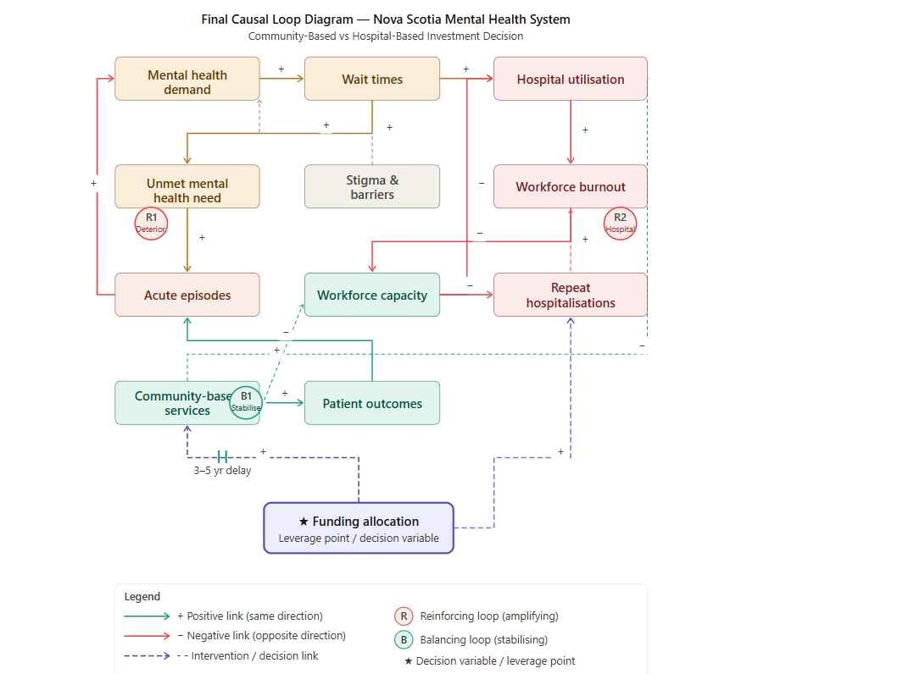

# Community-Based vs Hospital-Based Mental Health Investment in Nova-Scotia

## Decision Statement

Senior leadership within the Nova Scotia Department of Health and Wellness must decide whether to prioritize funding for community-based mental health services or hospital-based mental health care to reduce mental health service wait times over the next five years.

## Summary

Mental health demand in Nova Scotia has risen sharply due to population growth, aging demographics, and the lasting effects of the COVID-19 pandemic. The result is a system under strain: community counselling wait times climbed 45% between 2020 and 2023 (from 22 to 32 days median), 41.5% of Nova Scotians with a mental health disorder report unmet care needs, and hospital inpatient days have grown 17% over five years yet discharge rates have fallen 19%. The system is spending more on acute care and producing worse throughput.

This project applies a systems-thinking lens to the question of how the Department of Health and Wellness should allocate its mental health budget over the next five years. Using data from the Canadian Institute for Health Information (CIHI) and a Causal Loop Diagram framework, the analysis reveals that Nova Scotia's mental health system is locked in a Shifting the Burden dynamic: hospital-based acute care acts as a symptomatic fix that absorbs growing demand, while community-based prevention and early intervention the fundamental solution remains chronically under-resourced.

The evidence points clearly toward a community-first investment strategy. Community rehabilitation programs reduce inpatient days by up to 90% (CIHI/PMC evidence). Early intervention prevents the deterioration spiral that drives emergency department visits and repeat hospitalizations. Workforce burnout the key side effect feeding the hospital overload loop can only be broken by reducing avoidable admissions through upstream community services. While the returns on community investment take 3–5 years to materialize, the data show that the status quo leads to continued escalation. A community-first approach is not just preferable; it is structurally necessary to escape the current reinforcing cycle.

---

## Table of Contents

1. [Background](#background)
2. [Data Sources](#data-sources)
3. [Exploratory Findings](#exploratory-findings)
4. [System Dynamics — Causal Loop Diagram](#system-dynamics)
5. [System Archetype Analysis](#system-archetype-analysis)
6. [Scenario Analysis](#scenario-analysis)
7. [Leverage Point Analysis](#leverage-point-analysis)
8. [Recommendations](#recommendations)
9. [Limitations and Future Work](#limitations-and-future-work)
10. [References](#references)

---

[Background](Background.md)

## Initial Causal Loop Diagram (CLD)

## Data Sources Summary

The data for this project was sourced from the Canadian Institute for Health Information (CIHI) Your Health System Indicator Library, filtered to four mental health-specific indicators for Nova Scotia. The full source dataset contained approximately 48,002 rows spanning over 100 health system indicators. After filtering to mental health indicators only excluding any combined mental health and substance use measures that could not be disaggregated 616 rows were retained across the following four indicators: Canadians With a Mental Health Disorder Who Have an Unmet Need for Mental Health Care (2024), Self-Harm Hospitalizations (2013–2014 to 2024–2025), Self-Harm Including Suicide (2018–2019 to 2023–2024), and Wait Times for Community Mental Health Counselling (2020–2021 to 2024–2025). The filtered dataset was exported into a Tableau Hyper extract dataset3.hyper and used as the primary source for all visualizations in this milestone.

## Exploratory Data Analysis

### Visualization 1: Significant Variability in Schizophrenia Days Stayed

This visualization displays the distribution of age-standardized days stayed across different mental health categories in Nova Scotia, using a box plot to reveal the spread and variability within each group. Schizophrenia spectrum disorders stand out dramatically, showing a significantly wider range and higher median compared to all other categories, with values extending beyond 4,000 days stayed and outliers reaching close to 10,000. In contrast, categories such as anxiety disorders, mood disorders, and personality disorders cluster tightly at much lower values. This matters for the decision-maker because it highlights that schizophrenia-related hospitalizations are not only longer on average but also highly unpredictable in duration, placing a disproportionate and variable burden on Nova Scotia's inpatient mental health capacity. Understanding this variability is critical when planning resource allocation and bed availability across the health system.

### Visualization 2: Average Days Stayed by Province (Standardized)

This geographic visualization maps the average age-standardized days stayed for mental health hospitalizations across Canadian provinces, providing a national context for Nova Scotia's performance. The Northwest Territories records the highest average at 2,440 days stayed, followed by Ontario at 2,058, while British Columbia shows the lowest at 948. Nova Scotia, visible in the eastern region at 783 days stayed, falls below the national average, suggesting relatively shorter hospitalization durations compared to many other provinces. For the decision-maker, this geographic comparison is important because it situates Nova Scotia within the broader Canadian landscape, raising questions about whether shorter stays reflect efficient community-based care, earlier discharge, or potentially unmet post-discharge support needs all of which have direct implications for mental health system planning and investment decisions.

### Visualization 3: Days Stayed (Standardized) by Category

This grouped bar chart shows the average age-standardized days stayed broken down by mental health category across fiscal years 2019 through 2023, allowing both cross-category and year-over-year comparisons. Schizophrenia spectrum disorders consistently dominate across all years, with a notable peak in 2021 reaching approximately 3,700 days, before declining slightly in 2022 and 2023. Other categories including mood disorders, anxiety disorders, and personality disorders remain comparatively stable and low throughout the period. This visualization is valuable for the decision-maker because it shows that the overall burden of long mental health stays is not evenly distributed across diagnoses, and that the 2021 spike in schizophrenia-related stays may reflect pandemic-related disruptions to community mental health supports. Identifying which categories are driving hospitalization duration helps prioritize where targeted interventions would have the greatest impact.

### Visualization 4: Duration Stayed for Other Mental Health Disorders on the Rise

This line chart tracks the trend in average age-standardized days stayed by mental health category from 2019 to 2023, revealing how hospitalization durations have shifted over time. Schizophrenia spectrum disorders remain the highest across all years, peaking sharply in 2021 before moderating. Most notably, the "Other mental health disorders" category shows a steep and consistent upward trend from near zero in 2019 to approximately 1,350 by 2023, making it the fastest-growing category in the dataset. All other categories anxiety, mood, neurocognitive, and personality disorders remain relatively flat or show slight declines over the same period. For the decision-maker, this rising trend in the "Other" category is a critical signal, as it may indicate emerging or underclassified mental health conditions that the current system is not adequately capturing or prepared to address. Without proactive planning, this growing category could place increasing pressure on hospital capacity in the coming years, further tipping the balance away from community-based care.

## Refined Causal Loop Diagram

### R1: Deterioration Spiral (Reinforcing Loop)

Pathway: Mental Health Demand → Wait Times → Unmet Mental Health Need → Acute Episodes → Mental Health Demand

Rising demand overwhelms community counselling capacity, extending wait times. Patients who cannot access timely care develop worsening symptoms, leading to acute crises (ER visits, self-harm) which re-enter the system as new demand, amplifying the original pressure.

### Evidence from the data:

* Median community MH counselling wait rose 45%: 22 days (2020–21) → 32 days (2022–23) (CIHI Your Health System)

* 41.5% of Nova Scotians with a mental health disorder have unmet care needs; 54.9% among ages 18–34

* Self-harm hospitalisations are 2× higher in the lowest-income quintile (52 vs 28 per 100,000)

### Implication for the decision: 

Without intervention, R1 is self-amplifying unmet need breeds more acute cases, which generate more demand. Breaking this loop requires reducing wait times by expanding community-based intake capacity, making it a core argument for prioritising community investment.

### R2: Hospital Overload (Reinforcing Loop)
Pathway: Hospital Utilisation → Workforce Burnout → Workforce Capacity (−) → Hospital Utilisation (−) and Hospital Utilisation → Repeat Hospitalisations → Hospital Utilisation

High hospital utilisation exhausts clinical staff, causing burnout and attrition. Reduced workforce capacity lowers quality of inpatient care, leading to inadequate stabilisation and higher repeat hospitalisations which push utilisation even higher. The net effect is a reinforcing spiral of growing hospital burden.

### Evidence from the data:

* MH hospital days grew 17% over 5 years: 167,425 (2019–20) → 196,269 (2023–24) (CIHI)

* Repeat hospitalisation rate ~10.7% provincially; Eastern Zone worst at 14.1%

* Schizophrenia alone consumes ~57,000–66,000 inpatient days per year

### Implication for the decision:

Hospital-only investment risks feeding R2, more beds absorb more patients but without community follow-up, repeat admissions persist. The data shows 10.7% readmission despite rising bed-days, evidence that hospital capacity alone is insufficient. Workforce retention strategies must accompany any hospital funding.

### B1: Community Stabilisation (Balancing Loop)
Pathway: Community-Based Services → Patient Outcomes (+) → Acute Episodes (−)

Investment in community-based services (counselling, outreach, rehabilitation) improves patient outcomes before crises occur. Better outcomes reduce the frequency of acute episodes, which in turn eases pressure on hospitals and slows the demand entering R1. This is the system's natural counterbalance.

### Evidence from the data:

* Community rehabilitation programmes reduce inpatient days by up to 90% (Chien et al., 2024)

* Self-harm rate declining trend: 62 → 39 per 100,000 (2013–2023), suggesting existing community efforts work

* Wait >3 months worsens HoNOS clinical outcomes (Reichert & Jacobs, 2018) — early access matters

### Implication for the decision: 

B1 is the only balancing loop in the system and the primary lever for long-term stability. Activating it through community investment simultaneously weakens R1 (fewer people spiral into crisis) and relieves R2 (fewer acute admissions). This makes community-based funding the structurally dominant strategy for sustainable system improvement.

[Analysis](data/Analysis.md)

## Final Causal Loop Diagram

Nova Scotia's mental health system is governed by three interlocking feedback loops that together explain why the system continues to deteriorate despite growing investment.

**R1 — Deterioration Spiral (Reinforcing Loop)**

Rising mental health demand overwhelms community counselling capacity, extending wait times. Patients who cannot access timely care develop worsening symptoms, leading to acute crises emergency department visits and self-harm hospitalizations which re-enter the system as new demand, amplifying the original pressure. This loop is self-reinforcing: unmet need breeds more acute cases, which generate more demand. The data confirm it is actively operating: median community counselling wait times rose 45% between 2020 and 2023 (22 to 32 days); 41.5% of Nova Scotians with a mental health disorder report unmet care needs, rising to 54.9% among ages 18–34; and self-harm hospitalizations are twice as high in the lowest-income quintile (52 vs 28 per 100,000). Without intervention, R1 is self-amplifying. Breaking it requires reducing wait times by expanding community-based intake capacity.

**R2 — Hospital Overload Spiral (Reinforcing Loop)**

High hospital utilization exhausts clinical staff, causing burnout and attrition. Reduced workforce capacity lowers quality of inpatient care, leading to inadequate stabilization and higher repeat hospitalizations which push utilization higher still. Mental health inpatient days have grown 17% over five years (167,425 to 196,269) while discharge rates have fallen 19%. The repeat hospitalization rate stands at 10.7% provincially, reaching 14.1% in the Eastern Zone. Hospital-only investment risks feeding this loop more beds absorb more patients, but without community follow-up, readmissions persist. Workforce retention must accompany any hospital funding.

**B1 — Community Stabilisation (Balancing Loop)**

Investment in community-based services counselling, outreach, rehabilitation improves patient outcomes before crises occur. Better outcomes reduce acute episodes, easing pressure on hospitals and slowing demand entering R1. This is the system's only stabilising mechanism. Community rehabilitation programs reduce inpatient days by up to 90%, and the declining self-harm hospitalization trend (62 to 39 per 100,000 from 2013 to 2023) confirms that existing community efforts produce results even when underfunded.

**Leverage Point — Funding Allocation**

The single most impactful intervention point is the funding allocation decision itself. It is directly within departmental control and propagates effects through all three loops simultaneously: activating B1 (the fundamental solution), weakening R2 (reducing avoidable admissions and hospital burnout), and slowing R1 (reducing unmet need and deterioration). It is a Meadows-level "rules of the system" lever changing structural incentives. The key constraint is the 3–5-year delay before community investment shows population-level results, which requires political commitment to sustain investment through the transition period. The decision-maker's choice on funding allocation determines whether the system continues escalating or begins a sustainable stabilisation trajectory.

---

## Decision Recommendations

**To:** Senior Leadership, Nova Scotia Department of Health and Wellness

**Re:** Mental Health Funding Allocation, Five-Year Strategy

**Date:** April 2026

**Recommendation: Prioritize Community-Based Mental Health Investment**

The Department should allocate 60–70% of new mental health funding toward community-based services over the next five years while maintaining but not expanding existing hospital capacity. This recommendation is grounded in systems analysis of Nova Scotia's mental health data and represents the most structurally sound path to reducing wait times, improving patient outcomes, and achieving long-term system sustainability.

**The Evidence**

Nova Scotia's mental health system shows the signature pattern of a "Shifting the Burden" dynamic: hospital-based acute care has become the default response to rising demand, while community-based prevention the true solution remains chronically under-resourced. The numbers are clear. Hospital inpatient days have risen 17% over five years (167,425 to 196,269) while discharge rates have fallen 19%. The system is treating sicker patients for longer, not preventing deterioration. The repeat hospitalization rate of 10.7% provincially 14.1% in the Eastern Zone demonstrates that patients are being discharged without adequate community support and cycling back into acute care. Meanwhile, 41.5% of Nova Scotians with a mental health disorder report unmet care needs, and community counselling wait times have climbed 45% in three years. The current approach is consuming more resources and producing worse outcomes.

The evidence for community investment is compelling. Community rehabilitation programs reduce inpatient days by up to 90%. Early access to care is clinically significant patients who wait more than three months for mental health services show measurably worse outcomes. Reducing avoidable hospitalizations also directly addresses workforce burnout, the critical side effect that is eroding hospital capacity from within.

**Uncertainty**

This recommendation carries real risks that the Department should plan for. Community programs require 3–5 years to build capacity recruiting and training counsellors, establishing referral pathways, and demonstrating results. This delay creates political pressure to revert to visible, short-term hospital announcements. There is also a workforce supply constraint: Nova Scotia faces broader healthcare shortages, and expanding community mental health requires attracting specialists who may not be immediately available. A parallel workforce development strategy is essential. Finally, hospital capacity should not be cut during the transition; maintaining current levels while ramping community investment will prevent a gap period where demand exceeds capacity on both fronts.

**Specific next steps:** 
1. Immediately redirect 60% of new fiscal year mental health funding to community counselling capacity expansion, peer support programs, and early intervention services targeting the 54.9% unmet need rate among ages 18–34 as the highest-priority demographic
2. Establish a community mental health workforce recruitment and training pipeline in partnership with post-secondary institutions, with a 2-year target to increase the number of community counsellors and social workers
3. Improve post-discharge community follow-up protocols to address the 10.7% repeat hospitalization rate specifically piloting an Assertive Community Treatment (ACT) model in the Eastern Zone where the rate reaches 14.1%
4. Maintain hospital budgets at current levels during the 3–5 year transition rather than cutting them; communicate clearly that the goal is relieving hospital burden, not defunding hospital care
5. Set milestone-based mid-course evaluation at Year 2 and Year 4 measuring wait times, unmet need rates, and repeat hospitalizations as leading indicators of program effectiveness

---

## Limitations and Future Work

**Data limitations:** 

The CIHI dataset does not distinguish between different types of community mental health services, making it difficult to identify which specific interventions yield the strongest returns. The wait time data covers only 2020–2025, limiting long-term trend analysis. Rural vs urban breakdowns would strengthen equity analysis.

**Model limitations:** 

The Causal Loop Diagram is a qualitative tool it identifies the structure of feedback but does not produce quantitative forecasts. Future work could develop a System Dynamics simulation model (stock-and-flow) to generate more precise projections under each scenario.

**Scope limitations:** 

This analysis focuses on the funding allocation decision; it does not address specific program design, procurement processes, or inter-agency coordination mechanisms needed for implementation.

**Future research directions:**
- Workforce supply modeling: how many community mental health workers can realistically be recruited in Nova Scotia over 5 years?
- Program-level ROI analysis: comparing the cost-effectiveness of specific community interventions (ACT teams, peer support, school-based programs)
- Equity deep-dive: geographic and socioeconomic mapping of unmet need to guide targeting of new services
- Patient experience data: qualitative interviews with people who have navigated the system

---

## References

CIHI Your Health System Indicator Library (2013–2025). https://yourhealthsystem.cihi.ca/

Lora, A., et al. (2024). Community-based rehabilitation and mental health inpatient days. *PMC*. https://pmc.ncbi.nlm.nih.gov/articles/PMC11431192/

Reichert, A., & Jacobs, R. (2018). The impact of waiting time on patient outcomes: Evidence from early intervention in psychosis services in England. *Health Economics, 27*(11), 1772–1787. https://pmc.ncbi.nlm.nih.gov/articles/PMC6221005/

Clement, S., et al. (2015). What is the impact of mental health-related stigma on help-seeking? A systematic review. *Psychological Medicine, 45*(1), 11–27. https://pubmed.ncbi.nlm.nih.gov/24569086/

Government of Canada (2025). Government of Canada and Nova Scotia increase investment in province's community mental health supports. https://www.canada.ca/en/public-health/news/2025/01/government-of-canada-and-nova-scotia-increase-investment-in-provinces-community-mental-health-supports.html

World Health Organization. (2022). *World mental health report: Transforming mental health for all*. WHO.

Public Health Agency of Canada. (2023). *Mental health in Canada: COVID-19 and beyond*. Government of Canada.

